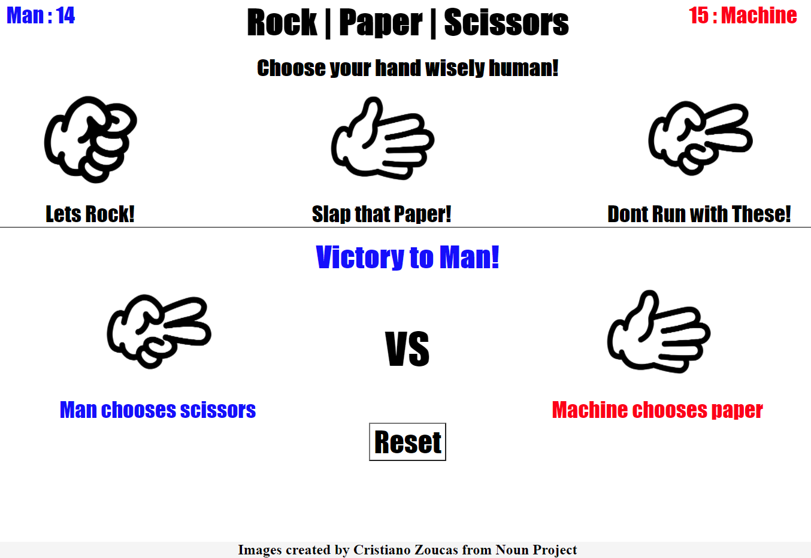

# Robot Uprising Rock Paper Scissors Game
A simple and fun Rock Paper Scissors Game with a hint of dystopia written entirely in JavaScript, HTML and CSS

Code Located [Here](https://github.com/hcuellar-coder/Rock-Paper-Scissors-Game)

Run Code [Here](https://hcuellar-coder.github.io/Rock-Paper-Scissors-Game/)

## Summary
Have you ever had to battle against a machine with humanity on the line? Our soon to be robotic enemies would want you to run away, but not this time. You're getting your reps in using this Rock Paper Scissors Game. Which, in our isolated dystopian world, is the only training method you need in defeating the robot overlords! 

I quite enjoyed the challenge of creating this simple Rock Paper Scissors Game. I was able to utilize what I've been learning with keeping data in the local storage. As well as tying in what I've learned pertaining to the relationship between JavaScript, HTML and CSS.

## Author
Heriberto Cuellar – Full Stack Software Developer - [LinkedIn](linkedin.com/in/heriberto-c-5aa11952)